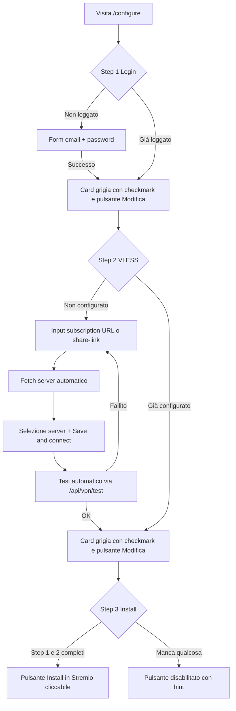

# /configure Wizard — Login → VLESS → Install (spec)

## 1. Obiettivo

Ridisegnare la pagina `/configure` come un **wizard a 3 step** con feedback visivo chiaro:

1. **Step 1 — Login Paramount+**: inserisci credenziali → feedback "✅ Fatto" → card diventa grigia/bloccata con pulsante "Modifica"
2. **Step 2 — Connetti VLESS**: incolli URL subscription (o share-link diretto) → fetch automatico server → salvataggio → **test automatico** (niente pulsante "Test connection" separato) → feedback "✅ Connesso — N server"
3. **Step 3 — Install to Stremio**: il pulsante diventa cliccabile **solo quando Step 1 E Step 2 sono completati**

**Bonus richiesto dall'utente**: rimuovere la sezione "🔌 HTTP Proxy" (legacy, non serve più) e la status bar ridondante.

## 2. Stato attuale (da modificare)

| File | Contenuto attuale | Problema |
|------|-------------------|----------|
| [`app/configure/page.tsx`](app/configure/page.tsx:286) | 4 card: Login, Install (gated solo su `manifestUrl`), Sports, VPN, Leagues | Install non è gated sulla VPN; nessun feedback "step completato" |
| [`app/configure/vpn-card.tsx`](app/configure/vpn-card.tsx:191) | Status bar + sezione VLESS + sezione HTTP Proxy + pulsante "Test connection" | Troppa roba; HTTP Proxy legacy; test manuale separato |
| [`app/api/vpn/setup/route.ts`](app/api/vpn/setup/route.ts:64) | `mode: 'vless'` accetta solo `subscriptionUrl` http(s):// | Non accetta share-link diretto |
| [`app/api/vpn/test/route.ts`](app/api/vpn/test/route.ts:13) | `GET /api/vpn/test` → test rapido | Va chiamato automaticamente dopo il save |

## 3. Architettura target



## 4. Modifiche ai file

### 4.1 `app/configure/page.tsx` — layout wizard

**Nuovo stato:**
```tsx
const [vpnActive, setVpnActive] = useState(false); // true quando VLESS è attivo
const [step1Done, setStep1Done] = useState(false); // derivato da manifestUrl
const [step2Done, setStep2Done] = useState(false); // derivato da vpnActive
```

**Step 1 — Login card** (riga 301-398):
- Mantieni il form esistente
- Nel ramo `manifestUrl` (già loggato): rendi la card visivamente "completata" — sfondo grigio, ✅, pulsante "Modifica" che riapre il form (resetta `manifestUrl` a null ma NON cancella la sessione server-side)
- Il pulsante "Modifica" deve solo riaprire il form in UI, non fare logout

**Step 2 — VLESS card** (riga 496):
- Passa `onVpnActiveChange={setVpnActive}` a `VpnSetupCard`
- La card mostra "✅ Connesso" quando `vpnActive` è true

**Step 3 — Install card** (riga 401):
- Cambia il gate da `{manifestUrl && ...}` a `{manifestUrl && vpnActive && ...}`
- Quando non pronto: mostra card con pulsante disabilitato e hint "Completa Step 1 e 2 per installare"
- Quando pronto: mostra URL + "⚡ Install in Stremio" (esistente)

**Ripristino stato al reload:**
- `useEffect` al mount: chiama `GET /api/vpn/status` per ripristinare `vpnActive` (se `config.kind === 'vless'`)
- Opzionale: nuovo endpoint `GET /api/auth/session` per ripristinare `manifestUrl` (vedi §4.4)

### 4.2 `app/configure/vpn-card.tsx` — semplificazione

**Rimuovere:**
- Sezione "🔌 HTTP Proxy" (righe 323-343) — intera
- Pulsante "🧪 Test connection" (righe 230-234) — il test diventa automatico
- Stato `proxyUrl`, funzione `submitProxy` (righe 82, 136-152)
- Badge "🔌 Proxy" nella status bar (righe 201-204)

**Nuova prop:**
```tsx
export function VpnSetupCard({ onToast, onVpnActiveChange }: {
    onToast: (msg: string) => void;
    onVpnActiveChange: (active: boolean) => void;
})
```

**Flusso VLESS aggiornato:**
1. Input accetta **URL subscription** O **share-link diretto** (`vless://`, `vmess://`, `trojan://`, `ss://`, `hysteria2://`)
2. Pulsante "🔍 Fetch servers" → `POST /api/vpn/preview` (esistente, per URL) oppure parse locale dello share-link
3. Selezione server (dropdown, esistente)
4. Pulsante "💾 Save & connect" → `POST /api/vpn/setup` (esistente)
5. **Dopo il successo**: chiama automaticamente `GET /api/vpn/test` e mostra il risultato inline (riusa il box risultato esistente, righe 242-262)
6. Se test OK → `onVpnActiveChange(true)` + card diventa "✅ Connesso — N server" con pulsante "Modifica"
7. Se test fallito → mostra errore, `onVpnActiveChange(false)`, l'utente può correggere

**Stato "attivo" (righe 273-279):**
- Mostra "✅ Active — tag · N server" + subscription mascherata
- Aggiungi pulsante "Modifica" che riapre il form (mantiene la config attiva finché non se ne salva una nuova)

### 4.3 `app/api/vpn/setup/route.ts` — supporto share-link diretto

Nel ramo `mode === 'vless'` (riga 64):
- Se `body.shareLink` è presente e inizia con `vless://|vmess://|trojan://|ss://|hysteria2://`:
  - Parsa con `parseShareLink` da [`lib/vpn/share-links.ts`](lib/vpn/share-links.ts:219)
  - Costruisci `servers = [parsed]` (senza fetch subscription)
- Altrimenti comportamento attuale (fetch subscription)

### 4.4 (Opzionale) `app/api/auth/session/route.ts` — nuovo endpoint

`GET /api/auth/session`:
- Ritorna `{ ok: true, loggedIn: boolean, manifestUrl?: string, installUrl?: string }`
- Legge la sessione corrente dal session-store (se esiste una sessione valida non scaduta)
- Serve per ripristinare lo Step 1 al reload della pagina

## 5. Flusso "cambio config futura" (risposta alla domanda dell'utente)

**Domanda**: "se domani devo cambiare la vless config perché scaduta, devo ripartire da qui e modificare? quello vecchio che non funziona più lo rimuovo? poi devo reinstallare l'addon?"

**Risposta**:
1. Vai su `/configure` → Step 2 mostra "✅ Connesso" → clicca **"Modifica"**
2. Incolla la nuova subscription URL (o share-link) → "Save & connect"
3. La vecchia config viene **sovrascritta** automaticamente (`writeSingBoxConfig` riscrive `config.json`, il watcher systemd riavvia sing-box entro ~5s)
4. **NON devi rimuovere nulla manualmente** — il pulsante "🗑️ Reset" esiste solo se vuoi disattivare del tutto la VPN
5. **NON devi reinstallare l'addon** — il manifest URL (`installUrl`) è legato alla sessione Paramount+, non alla config VPN. L'addon in Stremio continua a funzionare; cambia solo il proxy dietro le quinte

## 6. Test

1. `npx tsc --noEmit` + `npx eslint .`
2. Manuale (browser):
   - Login → Step 1 diventa grigio con ✅
   - Inserisci subscription VLESS → fetch server → save → test automatico → Step 2 ✅
   - Step 3 Install diventa cliccabile
   - "Modifica" su Step 2 → cambia URL → save → verifica che la vecchia config sia sovrascritta
   - Verifica che l'addon in Stremio continui a funzionare senza reinstall
3. Test share-link diretto: incolla un singolo `vless://...` → deve funzionare senza subscription URL

## 7. File toccati (riepilogo)

| File | Azione |
|------|--------|
| [`app/configure/page.tsx`](app/configure/page.tsx) | Wizard layout, gating Install su `vpnActive`, stato step, ripristino al reload |
| [`app/configure/vpn-card.tsx`](app/configure/vpn-card.tsx) | Rimuovi HTTP Proxy + Test button, auto-test, prop `onVpnActiveChange`, supporto share-link |
| [`app/api/vpn/setup/route.ts`](app/api/vpn/setup/route.ts) | Accetta `shareLink` diretto nel mode vless |
| [`app/api/auth/session/route.ts`](app/api/auth/session/route.ts) | **Nuovo** (opzionale): ripristino stato login al reload |