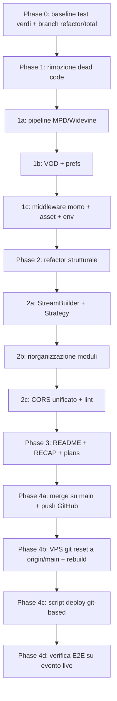

# Piano di Refactor Totale — paramount-stremio

> Decisioni concordate: **live-only definitivo** (rimozione pipeline VOD/replay/MPD-Widevine),
> strategia **incrementale su branch `refactor/total`** (ogni fase con test verdi + deploy di verifica),
> deploy **git-based** sulla VPS (addio scp).

---

## 1. Stato di partenza (verificato)

| Aspetto | Stato |
|---|---|
| Repo GitHub | `superaprile98/paramount-stremio-v2` — **pubblica e aggiornata** (push 31/08 08:48, `565fe93`). Il remote locale punta già lì. Nessuna azione necessaria se non il push delle fasi successive. |
| VPS (92.4.220.196) | **Divergente**: ferma a `c281b32` con modifiche deployate via scp (equivalenti ai commit locali successivi). Da riallineare via git. |
| Test | 125 test vitest, tutti verdi alla data del RECAP. |
| Vista funzionale | Sports-only live: catalogo "Live e Prossimi" + "Sport" con dropdown leghe, DVR From Start, HLS AES-128 proxato. |

## 2. Dead code individuato (da rimuovere)

1. **Pipeline MPD/Widevine (DASH)**: [`lib/paramount/proxy/mpd.ts`](../lib/paramount/proxy/mpd.ts), `app/api/proxy/[sid]/mpd/route.ts`, `app/api/proxy/[sid]/license/route.ts`, `app/api/proxy/[sid]/seg/route.ts` (segmenti DASH — verificare che nessun percorso HLS/DVR lo usi prima di rimuovere), `tests/mpd.test.ts`, ramo `.mpd` nella stream route.
2. **VOD**: [`lib/paramount/types/vod.ts`](../lib/paramount/types/vod.ts) (`getTrendingMovies`, `getTrendingShows`, `searchVod`, `buildMovieMeta`, `buildSeriesMeta`, `resolveVodStream`), rami movie/series in meta route e catalogs, `types: ["movie","series"]` dal manifest.
3. **Prefs**: `app/api/stremio/[key]/prefs/route.ts` + [`lib/paramount/prefs.ts`](../lib/paramount/prefs.ts) — il manifest **non dichiara più `preferences`**, quindi Stremio non chiamerà mai la route (verificare con grep finale).
4. **Middleware morto**: [`proxy.ts`](../proxy.ts) alla radice esporta `proxy`, ma Next.js esegue solo `middleware.ts` con export `middleware` → mai eseguito.
5. **Asset vecchi**: `public/favicon-old.ico`, `public/icon-old.png`.
6. **README outdated**: documenta endpoint IPTV (`/api/iptv/...`), MFP proxy (`MFP_URL`), cataloghi VOD/Upcoming/Replay — tutti rimossi dal codice (grep conferma: 0 riferimenti a `MFP_URL`/`iptv` nei sorgenti).
7. **Tipi stale**: genre `"Upcoming" | "Replay"` nel catalog route (le opzioni ora sono "Tutte" + nomi leghe).
8. **Duplicazione**: la stream route ripete il blocco `streams.push({...})` con varianti quasi identiche 4-5 volte.

## 3. Architettura target e design pattern

**Strategia**: refactor incrementale, non riscrittura. Il codice è già stratificato (logica pura in `lib/`, route sottili) — consolidiamo invece di stravolgere.

**Pattern scelti** (pragmatici, niente over-engineering):

- **Layered / Ports & Adapters (light)**: le route `app/api/**` restano **adapter HTTP sottili** (parse params → chiamata al service → serializzazione). Nessuna logica di business nelle route.
- **Strategy** per la risoluzione dello stream: `LiveHlsStrategy`, `DvrStrategy`, `ChannelStrategy` dietro un'interfaccia comune `resolveStream(ctx) → StreamCandidate[]` — la stream route itera le strategie invece di ramificare con if/else.
- **Builder** per gli oggetti stream Stremio: un `StreamBuilder` con fluent API (`name()`, `title()`, `live()`, `url()`) elimina la duplicazione dei `streams.push({...})`.
- **Factory** per `ParamountClient`/httpClient (pool proxy sing-box già centralizzato in `lib/http/client.ts` — si consolida, non si riscrive).

**Struttura target di `lib/paramount/`** (oggi `types/` contiene logica, non solo tipi — nome fuorviante):

```
lib/
├── auth/            # jwe, session-store        (invariato)
├── http/            # client, sid               (invariato)
├── stremio/         # manifest, types, cors, streams (NUOVO: builder)
├── paramount/
│   ├── client.ts    # client API Paramount+
│   ├── mapping.ts   # id mapping
│   ├── utils.ts     # helper puri
│   ├── sports/      # merge catalogs.ts + sports.ts (unica fonte catalogo sport)
│   ├── live/        # da types/live.ts (canali live)
│   └── proxy/       # hls.ts, dvr.ts (mpd.ts RIMOSSO)
├── vpn/             # singbox, share-links, probe, storage (invariato)
```

## 4. Workflow



Ogni fase termina con: `npm run test` verde → `npm run lint` pulito → commit atomico.
Al termine delle Phase 1-2: deploy di verifica sulla VPS (git-based, già collaudato in Phase 4b anticipato come allineamento iniziale — vedi §5).

## 5. Allineamento VPS e deploy git-based

**Allineamento iniziale (subito dopo Phase 0, prima del refactor):**
1. SSH: `ssh -i ~/.ssh/oracle-vm.key ubuntu@92.4.220.196`
2. Backup di sicurezza: `.env`, volume `paramount-stremio_paramount-data` (install-tokens/sessioni).
3. In `/home/ubuntu/server-stack/paramount-stremio/`: verificare `git status`, confrontare le modifiche non committate con il main locale (il RECAP conferma che il contenuto è già allineato al main locale, deployato via scp).
4. `git stash && git fetch origin && git reset --hard origin/main && git stash pop` (o drop se il diff è nullo) → la VPS lavora d'ora in poi solo via git.
5. `docker compose up -d --build paramount` e verifica `http://localhost:7850/api/health`.

**Deploy git-based (da qui in poi):**
- `scripts/deploy-docker.sh` riscritto: SSH → `git fetch && git reset --hard origin/main` → `docker compose up -d --build` → health check.
- `deploy/oracle/README.md` aggiornato con il nuovo flusso (deploy = `git push` + script).
- Regola: **nessun file toccato a mano sulla VPS**; ogni modifica passa da un commit.

## 6. Definition of Done (per fase)

- [ ] `npm run test` verde (125 test, meno quelli rimossi con mpd/prefs)
- [ ] `npm run lint` senza errori
- [ ] `next build` ok
- [ ] Commit atomico con messaggio conventional (`refactor:`, `chore:`, `docs:`)
- [ ] Deploy di verifica su VPS con health check 200
- [ ] Verifica finale E2E: manifest, catalog "Live e Prossimi", stream HLS + DVR su una partita live

## 7. Rischi e mitigazioni

| Rischio | Mitigazione |
|---|---|
| Route `seg` DASH usata anche da HLS/DVR | Grep incrociato prima della rimozione; i percorsi HLS usano `/api/stremio/[key]/proxy/seg`, il DVR usa `dvrseg` |
| Rimozione VOD rompe meta route per id legacy | Il manifest non espone più cataloghi movie/series → nessun id VOD raggiungibile; test lo confermano |
| Reset git sulla VPS perde config locali | Backup `.env` + volumi prima del reset; `.env` è gitignored e resta fuori dall'albero |
| Divergenza futura VPS↔git | Deploy solo via script git-based; nessun scp manuale |
