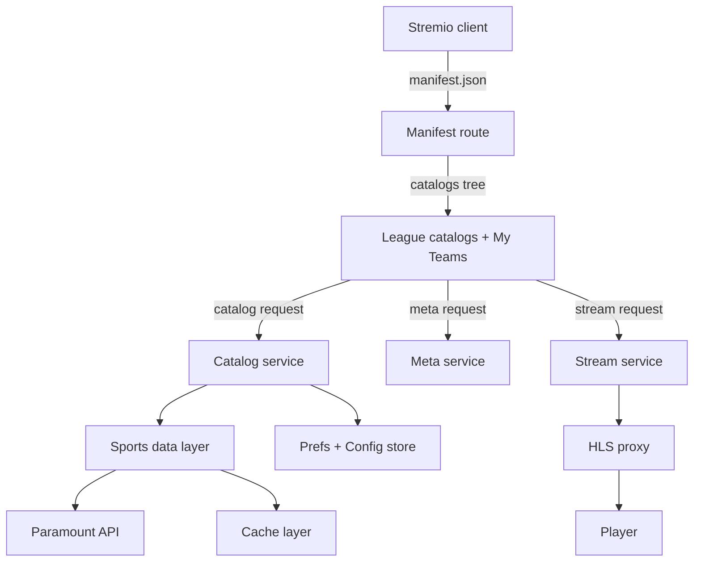
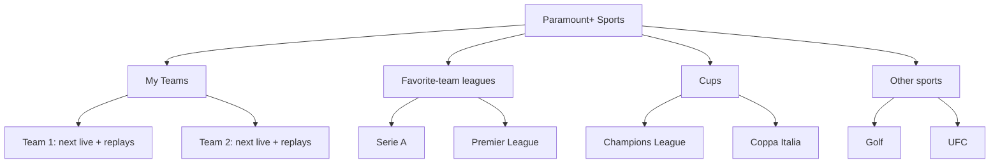

# Technical Specification — Sports-Only Streaming View for the Paramount+ Stremio Addon

**Status:** Draft for review (rev. 2 — incorporates user feedback)
**Author:** Architect
**Target:** `paramount-stremio` addon (Next.js / Node.js, Docker-deployed)
**Related code:** [`lib/paramount/types/sports.ts`](../lib/paramount/types/sports.ts), [`lib/paramount/catalogs.ts`](../lib/paramount/catalogs.ts), [`app/api/stremio/[key]/manifest.json/route.ts`](../app/api/stremio/[key]/manifest.json/route.ts), [`lib/paramount/client.ts`](../lib/paramount/client.ts)

---

## 1. Executive Summary

The current addon exposes a single flat "Paramount+ Sports" catalog that lists only **live and upcoming** events from one endpoint. The user wants a **sports-first experience**:

- **Hide movies/series** entirely (they are duplicates of the rest of the addon).
- Organize content by **league/competition**, with **both live and match replays** per league (confirmed available in the Paramount web app — e.g., old Serie A matches can be rewatched).
- Provide a **favorite-team dashboard** (per profile, **multiple teams allowed**) that surfaces the next live match and the team's past matches.
- Allow **per-user configuration** of which sports/leagues to show or hide.
- Order the interface by **priority**: favorite teams first, then their leagues, then cups, then all other sports — without overloading the UI.

This specification defines the product goals, user stories, acceptance criteria, technical architecture, data models, UI/UX requirements, and an implementation plan. It is scoped to the Stremio addon protocol (catalog/meta/stream resources) running in the existing Next.js/Docker environment.

---

## 2. Goals

| # | Goal | Priority |
|---|------|----------|
| G1 | Make sports the only content surface (remove movies/series) | High |
| G2 | Organize content by league/competition with **live + replay** per league | High |
| G3 | Support **per-user configuration** of which sports/leagues to show/hide | High |
| G4 | Provide a **favorite-team dashboard** (per profile, multiple teams) | High |
| G5 | Order the interface by priority: favorite teams → leagues → cups → other sports | High |
| G6 | Keep the addon performant, cached, and resilient to Paramount API changes | Medium |
| G7 | Remain deployable via Docker (local Windows now, VPS later) with no breaking changes | Low |

---

## 3. User Stories

### 3.1 Catalog organization
- **US-1:** As a user, I can open the addon and see a **Sports** section organized by league/competition, ordered by my priorities.
- **US-2:** As a user, I can filter a league catalog by **Live / Upcoming / Replay** status.
- **US-3:** As a user, I can search within a league for a specific team or match.

### 3.2 Replays / past matches
- **US-4:** As a user, I can browse **past matches** for a league (e.g., all recent Serie A matches) and watch a replay.
- **US-5:** As a user, I can see the **date and result** (if available) of a past match in its metadata.

### 3.3 Favorite teams (per profile, multiple)
- **US-6:** As a user, I can set **one or more favorite teams**.
- **US-7:** As a user, I can open a **"My Teams"** dashboard showing each team's **next live match** and its **recent past matches**.
- **US-8:** As a user, I can add, remove, or reorder my favorite teams.

### 3.4 Per-user configuration
- **US-9:** As a user, I can choose which **sports/leagues** appear in my addon (show/hide).
- **US-10:** As a user, my configuration is saved per profile and persists across sessions.

### 3.5 Streams
- **US-11:** As a user, I can play a live, upcoming (if available), or replay stream through the existing HLS proxy.

---

## 4. Acceptance Criteria

- **AC-1:** The manifest exposes a sports catalog tree (per-league catalogs + "My Teams") and **no longer lists movie/series catalogs**.
- **AC-2:** Each league catalog returns only events belonging to that league, with correct `type: "tv"` metas.
- **AC-3:** The `genre` extra filter supports `Live`, `Upcoming`, and `Replay` for each league catalog.
- **AC-4:** Past matches are retrievable from a Paramount endpoint and mapped to metas with start time and, when available, result.
- **AC-5:** A per-profile preference store supports **multiple favorite teams** and drives a dedicated "My Teams" catalog.
- **AC-6:** A per-profile configuration store controls which sports/leagues are shown/hidden.
- **AC-7:** Catalog ordering follows the priority rule: favorite teams → their leagues → cups → other sports.
- **AC-8:** Stream resolution reuses the existing `resolveSportStream` + HLS proxy path; no new DRM handling is required.
- **AC-9:** All catalogs are cached with a TTL and degrade gracefully (empty list, not a 500) when the upstream API fails or the session expires.
- **AC-10:** `tsc --noEmit` passes, existing 61 tests pass, and new unit tests cover the new mapping/filter/preference logic.

---

## 5. Current-State Analysis (as-is)

### 5.1 Existing sports flow
- **Manifest** ([`manifest.json/route.ts`](../app/api/stremio/[key]/manifest.json/route.ts:18)) declares one sports catalog: `{ type: "tv", id: "pplus_sports", name: "Paramount+ Sports" }` with `genre` options `["Live", "Upcoming"]`, plus `search` and `skip`. It also declares movie/series catalogs.
- **Catalog** ([`catalogs.ts`](../lib/paramount/catalogs.ts:58)) calls `getSportListing(session, false)`, filters by `genre` (Live/Upcoming), maps via `mapSportListingToMeta`, sorts by start time, and paginates.
- **Data source** ([`client.ts`](../lib/paramount/client.ts:267)): `getSportsLiveUpcoming()` → `GET /v3.0/androidtv/hub/multi-channel-collection/live-and-upcoming.json` (rows 300).
- **Mapping** ([`sports.ts`](../lib/paramount/types/sports.ts:7)): `mapSportListingToMeta` builds a `StremioMeta` with `id: pplus:sport:<listingId>`, `type: "tv"`, `posterShape: "landscape"`, and a description string that includes league label, channel, LIVE flag, and start/end times.
- **League label** ([`utils.ts`](../lib/paramount/utils.ts:232)): `pickLeagueLabel` reads `gameData.competition/league/sport/tournament` and joins them into a single string.
- **Stream** ([`sports.ts`](../lib/paramount/types/sports.ts:121)): `resolveSportStream` finds the listing, gets an Irdeto session token, picks the manifest URL, and returns it for the HLS proxy.

### 5.2 Gaps vs. requirements
| Requirement | Current state | Gap |
|-------------|---------------|-----|
| League/competition organization | Flat single catalog; league is a free-text label | No per-league catalogs; no structured league id |
| Replays / past matches | Only `live-and-upcoming` endpoint | No archived/replay data source wired in |
| Favorite teams (multiple) | Not present | No preference model or dashboard |
| Per-user show/hide config | Not present | No configuration model |
| Sports-only surface | Movies/series still exposed | Manifest still lists movie/series catalogs |
| Priority ordering | Flat sort by start time | No priority-based ordering |

---

## 6. Target Architecture

### 6.1 High-level flow



### 6.2 Component breakdown

| Component | Responsibility | Files (proposed) |
|-----------|----------------|------------------|
| **Manifest builder** | Declare per-league catalogs + "My Teams"; remove movie/series | `app/api/stremio/[key]/manifest.json/route.ts` |
| **Sports data layer** | Fetch live/upcoming + replays; normalize into `SportEvent` | `lib/paramount/sports/data.ts` (new) |
| **League index** | Derive a stable list of leagues/competitions from events | `lib/paramount/sports/leagues.ts` (new) |
| **Catalog service** | Route catalog requests to league/status/team filters + priority ordering | `lib/paramount/catalogs.ts` (extend) |
| **Meta service** | Build `StremioMeta` for a single event | `lib/paramount/types/sports.ts` (extend) |
| **Stream service** | Resolve HLS manifest for an event | `lib/paramount/types/sports.ts` (reuse) |
| **Prefs store** | Persist favorite teams + show/hide config per profile | `lib/paramount/prefs.ts` (new) |
| **Cache layer** | TTL cache for events, league index, prefs | `lib/paramount/sports/cache.ts` (new) |

### 6.3 Stremio integration points

- **Catalogs:** Each league becomes a catalog with `id: "pplus_sports_<leagueKey>"` and `type: "tv"`. The `genre` extra drives Live/Upcoming/Replay. A special catalog `id: "pplus_sports_myteams"` drives the favorite-team dashboard.
- **Meta:** `meta/tv/pplus:sport:<listingId>.json` returns a single event's metadata (reuse `buildSportMeta`).
- **Stream:** `stream/tv/pplus:sport:<listingId>.json` returns the HLS stream (reuse `resolveSportStream`).
- **ID scheme:** Keep `pplus:sport:<listingId>` for events. Add `pplus:sportleague:<leagueKey>` for league catalogs and `pplus:sportteam:<teamKey>` for team-level browsing (optional).

---

## 7. Data Models

### 7.1 Unified sport event (normalized from Paramount responses)

```ts
export interface SportEvent {
    id: string;                 // Paramount listing id
    title: string;              // e.g. "Arsenal vs Chelsea"
    sport: string;              // e.g. "soccer", "american-football", "basketball", "combat", "golf", "other"
    league: {
        key: string;            // stable slug, e.g. "premier-league"
        name: string;           // "Premier League"
        competition?: string;   // e.g. "Premier League"
        tournament?: string;    // e.g. "Matchweek 12"
        kind: "league" | "cup" | "tournament";  // for priority ordering
    };
    teams: {
        home?: { name: string; key?: string };
        away?: { name: string; key?: string };
    };
    status: "live" | "upcoming" | "replay";
    startMs?: number;
    endMs?: number;
    result?: string;            // e.g. "2-1" when available
    channelName?: string;
    channelSlug?: string;
    videoContentId?: string;
    posterUrl?: string;
    logoUrl?: string;
    raw: unknown;               // original listing for stream resolution
}
```

### 7.2 League index

```ts
export interface SportLeague {
    key: string;        // stable slug
    name: string;       // display name
    sport: string;      // sport category
    kind: "league" | "cup" | "tournament";
    eventCount: number;
    hasLive: boolean;
    hasReplay: boolean;
}
```

### 7.3 Per-profile preferences and configuration

```ts
export interface SportPrefs {
    favoriteTeams: Array<{ key: string; name: string }>;  // ordered, multiple allowed
    hiddenLeagues: string[];   // league keys the user chose to hide
    // If empty, all leagues are shown; if non-empty, only non-hidden leagues show.
}
```

### 7.4 Status derivation

| Condition | Status |
|-----------|--------|
| `isListingLive === true` OR `startMs <= now < endMs` | `live` |
| `startMs > now` | `upcoming` |
| `endMs < now` (or from a replay endpoint) | `replay` |

---

## 8. Supported Sports & Leagues (curated catalog)

The following is the full set of content the user wants surfaced, grouped by sport. Each entry is a candidate league/competition catalog.

### 8.1 Calcio (Soccer)
| Competition | Kind | Notes |
|-------------|------|-------|
| UEFA Champions League | cup | English language |
| UEFA Europa League | cup | |
| UEFA Conference League | cup | |
| UEFA Super Cup | cup | |
| UEFA Women's Champions League | cup | |
| Serie A | league | |
| Coppa Italia | cup | |
| Scottish Premiership (SPFL) | league | |
| EFL Championship | league | |
| Carabao Cup (English League Cup) | cup | |
| Liga Profesional Argentina | league | |
| Brasileirão | league | |
| NWSL (National Women's Soccer League) | league | |
| CONCACAF Nations League | cup | |
| AFC Champions League | cup | |

### 8.2 Football Americano (American Football)
| Competition | Kind | Notes |
|-------------|------|-------|
| NFL on CBS | league | Sunday afternoon games, AFC playoffs, CBS Super Bowls |
| College Football (NCAA) | league | Big Ten + other CBS conferences |

### 8.3 Pallacanestro (Basketball)
| Competition | Kind | Notes |
|-------------|------|-------|
| NCAA Men's Basketball | league | March Madness + regular season |
| WNBA | league | Selected matches with CBS Sports |

### 8.4 Sport da Combattimento (Combat)
| Competition | Kind | Notes |
|-------------|------|-------|
| UFC | tournament | Fight Night, numbered cards, Contender Series |
| Boxing (Zuffa Boxing) | tournament | |

### 8.5 Altri Sport (Other)
| Competition | Kind | Notes |
|-------------|------|-------|
| Golf (PGA Tour) | tournament | Weekend final rounds |
| The Masters | tournament | Via CBS feed |
| PBR Team Series (Rodeo/Bull Riding) | tournament | |
| SailGP (Sailing) | tournament | |
| World Rugby (Rugby) | tournament | |

> **Note:** The exact league keys and whether Paramount exposes per-league endpoints must be confirmed in Phase 0. The curated list above drives the league index and the per-user configuration UI.

---

## 9. UI/UX Requirements

### 9.1 Priority-based catalog ordering

The interface must be navigable and **not overloaded**. Ordering follows this priority rule:

1. **My Teams** — everything related to the user's favorite teams (next live match + recent replays), shown first.
2. **Leagues of favorite teams** — the championships the favorite teams play in.
3. **Cups** — cup competitions (Champions League, Coppa Italia, etc.).
4. **All other sports** — remaining leagues/tournaments the user has not hidden.



### 9.2 Catalog tree (Stremio home)

```
Paramount+ Sports
├── ⭐ My Teams
│   ├── Inter (next live + replays)
│   └── Arsenal (next live + replays)
├── 🏆 Serie A            (favorite-team league)
├── 🏴 Premier League     (favorite-team league)
├── 🏆 Champions League   (cup)
├── 🏆 Coppa Italia       (cup)
├── 🏈 NFL on CBS         (other sport)
├── ⛳ Golf               (other sport)
└── ... (only non-hidden leagues)
```

- Each league catalog uses `type: "tv"` and a landscape poster shape.
- The `genre` extra exposes `Live`, `Upcoming`, `Replay` as filter chips.
- `search` filters by team or match title within the league.
- Hidden leagues (per user config) are omitted from the tree.

### 9.3 My Teams dashboard

- **Next live match:** the nearest upcoming/live event for each favorite team, shown first with a prominent "LIVE" badge if applicable.
- **Recent matches:** each team's past events (replays), sorted by date descending.
- **Empty state:** if no favorite teams are set, show a helpful message and a list of teams to pick from.

### 9.4 Metadata display

- **Name:** match title (e.g., "Arsenal vs Chelsea").
- **Description:** league • competition • channel • status (LIVE/Replay) • start time • result (if available).
- **Poster/background:** landscape artwork when available.
- **Release info:** UTC start time.

### 9.5 Configuration UI (per profile)

Extend the existing `/configure` page with two sections:
1. **Favorite Teams:** searchable multi-select of teams (add/remove/reorder).
2. **Sports & Leagues:** a list of all leagues with show/hide toggles, grouped by sport.

---

## 10. Backend Design

### 10.1 Data sources (Paramount API)

| Endpoint | Purpose | Status |
|----------|---------|--------|
| `GET /v3.0/androidtv/hub/multi-channel-collection/live-and-upcoming.json` | Live + upcoming events | Existing |
| Replay/archive endpoint (TBD) | Past matches / replays | **To investigate — key risk** |
| Per-league endpoint (TBD) | Per-league live/upcoming/replay | **To investigate** |

> **Risk:** The current codebase only consumes the live-and-upcoming endpoint. Whether Paramount exposes a **replay/archive** endpoint (and its exact shape) must be confirmed during Phase 0 discovery. The user confirmed replays exist in the web app, so the endpoint exists — it must be located and mapped.

### 10.2 Normalization pipeline

1. Fetch raw listings from all configured sport endpoints (live/upcoming + replay).
2. Normalize each into `SportEvent` (derive sport, league key/kind, teams, status, result).
3. Build/refresh the league index.
4. Apply per-profile prefs (hide hidden leagues; mark favorite teams).
5. Cache events + index + prefs with appropriate TTLs.
6. Serve catalog/meta/stream requests from the normalized model.

### 10.3 Caching strategy

| Cache | Key | TTL | Notes |
|-------|-----|-----|-------|
| Live/upcoming events | session fingerprint | 30s | Reuse existing pattern in `sports.ts` |
| Replay events | session fingerprint | 5 min | Replays change rarely |
| League index | session fingerprint | 1 min | Derived from events |
| Prefs/config | profile id | 1 min | Persisted; cached for reads |
| Master manifest | URL + auth | 30s | Existing `MASTER_CACHE_TTL` |

### 10.4 Error handling

- If the upstream API returns an error or empty data, return an **empty catalog** (not a 500).
- If the session is expired, the catalog route should surface a clear message (the existing `denied` handling) rather than crash.
- Wrap all upstream fetches in try/catch; log warnings with truncated bodies (existing pattern in `HttpClient`).
- Never let a single league's failure break the whole catalog tree.

### 10.5 Performance

- Reuse the existing per-session cache to avoid hammering Paramount on every Stremio scroll.
- Paginate with `skip` (existing pattern) and cap page size at 100.
- Derive league catalogs from a single normalized fetch, not N upstream calls.
- Keep the manifest catalog list small (only non-hidden leagues) to avoid a heavy home screen.

---

## 11. Frontend Considerations

- The addon is **server-rendered** (Next.js API routes); there is no client-side SPA for catalogs.
- The only client UI is the existing `/configure` page. Extend it with:
  - A **favorite-team multi-select** (searchable list of teams derived from the league index).
  - A **sports/leagues show-hide** panel grouped by sport.
- All catalog/meta/stream responses must include CORS headers (existing `withCors`/`optionsCors`).
- Set the manifest `types` to `["tv"]` (movies/series removed).

---

## 12. Implementation Phases

### Phase 0 — Discovery (blocking)
- **Task 0.1:** Inspect the live-and-upcoming response to confirm the exact shape of `gameData`, team fields, league identifiers, and sport category.
- **Task 0.2:** Locate and document the **replay/archive** sports endpoint (URL, params, response shape) — confirmed to exist in the web app.
- **Task 0.3:** Confirm whether per-league endpoints exist or whether league filtering must be done client-side from the aggregate feed.
- **Task 0.4:** Map the curated league list (Section 8) to real league keys/identifiers.
- **Deliverable:** A discovery note appended to this spec; unblocks Phases 1–4.

### Phase 1 — Data model + normalization
- **Task 1.1:** Add `SportEvent`, `SportLeague`, `SportPrefs` types.
- **Task 1.2:** Implement `normalizeSportEvent(raw)` (sport, league key/kind, teams, status, result).
- **Task 1.3:** Implement `buildLeagueIndex(events)`.
- **Task 1.4:** Add unit tests for normalization and status derivation.
- **Deliverable:** `lib/paramount/sports/data.ts` + tests.

### Phase 2 — League catalogs + priority ordering
- **Task 2.1:** Extend the manifest to declare per-league catalogs + "My Teams"; remove movie/series.
- **Task 2.2:** Extend `getCatalogMetas` to route `pplus_sports_<leagueKey>` and `pplus_sports_myteams`.
- **Task 2.3:** Add `Replay` to the `genre` extra options.
- **Task 2.4:** Implement priority ordering (favorite teams → leagues → cups → other sports).
- **Task 2.5:** Add tests for catalog routing, filtering, and ordering.
- **Deliverable:** Working per-league catalogs in Stremio with correct ordering.

### Phase 3 — Preferences + configuration
- **Task 3.1:** Implement `lib/paramount/prefs.ts` (per-profile favorite teams + hidden leagues).
- **Task 3.2:** Add favorite-team multi-select and sports/leagues show-hide to `/configure`.
- **Task 3.3:** Implement the "My Teams" catalog (next live + recent replays per team).
- **Task 3.4:** Add tests for preference persistence and dashboard assembly.
- **Deliverable:** Working "My Teams" dashboard + configuration UI.

### Phase 4 — Replays
- **Task 4.1:** Wire the replay data source (from Phase 0) into the data layer.
- **Task 4.2:** Map replay events to metas with date + result.
- **Task 4.3:** Add tests for replay filtering.
- **Deliverable:** Replay browsing per league and per team.

### Phase 5 — Hardening + release
- **Task 5.1:** Add caching for replays, league index, and prefs.
- **Task 5.2:** Add error-handling tests (empty/denied/expired).
- **Task 5.3:** Run `tsc --noEmit`, lint, and full test suite.
- **Task 5.4:** Rebuild Docker image, verify health, and update README.
- **Deliverable:** Release-ready build.

---

## 13. Risks and Mitigations

| Risk | Impact | Mitigation |
|------|--------|------------|
| Replay endpoint shape unknown | Replays delayed | Phase 0 discovery; user confirmed it exists in the web app |
| League identifiers unstable / free-text | Fragmented catalogs | Normalize via a curated league-key map (Section 8) |
| Team names inconsistent across feeds | Favorite-team matching fails | Normalize team names; fuzzy match; allow manual pick |
| Session expiry breaks catalogs | Empty/denied views | Graceful empty catalogs + clear messaging; re-auth flow |
| Upstream rate limiting | Slow catalogs | Aggressive TTL caching; single aggregate fetch |
| Too many catalogs overload home screen | Poor UX | Only non-hidden leagues in manifest; priority ordering |

---

## 14. Out of Scope (for this iteration)

- DRM/Widevine handling (unchanged; HLS proxy already handles AES-128).
- Live score tickers or push notifications.
- Non-sports content (movies/series) — intentionally removed.

---

## 15. Open Questions

1. Does the replay endpoint return **results/scores** for past matches, or only availability? (Phase 0)
2. Are there **per-league** endpoints, or must we filter the aggregate feed? (Phase 0)
3. Should favorite teams be stored **per profile** (multiple) — confirmed yes; how are profiles identified in the JWE session? (Phase 3)
4. Should the show/hide config default to **all shown** or a curated default set? (Phase 3)
