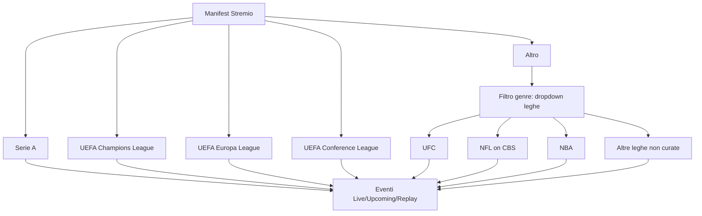

# Piano — Rework Vista Sports (tipo "sport", niente My Teams, Altro con dropdown, fix replay)

> **Nota aggiunta**: include anche il fix del pulsante "Open in Stremio" che non funziona in locale.

## Obiettivo

Rielaborare la vista sports-only in base al nuovo feedback dell'utente:

1. **Rimuovere la sezione "My Teams"** (non più una sezione fissa in home).
2. **Rinominare il tipo catalogo da "tv" a "sport"** → in Stremio la sezione si chiamerà "Sport" invece di "TV Channel".
3. **4 sezioni fisse**: Serie A, UEFA Champions League, UEFA Europa League, UEFA Conference League.
4. **"Altro" con dropdown per lega**: cliccando su Altro, un filtro genre permette di scegliere tra le leghe rimanenti (UFC, NFL, NBA, ecc.).
5. **Fix dei replay**: indagare perché `previousListings` non produce eventi "replay" e correggere.

---

## 0. Fix "Open in Stremio" (deep-link non funziona in locale)

### Sintomo
Il pulsante "Open in Stremio" apre Stremio ma l'addon non si installa; l'utente deve incollare il manifest a mano.

### Root cause
In [`app/api/auth/device/poll/route.ts`](app/api/auth/device/poll/route.ts:41) il `manifestUrl` è costruito con:
```js
const base = (process.env.BASE_URL?.replace(/\/$/, '') ?? url.origin) || "http://localhost:3000";
const manifestUrl = `${base}/api/stremio/${key}/manifest.json`;
```
Il deep-link è `stremio://` + `manifestUrl` (in [`app/configure/page.tsx`](app/configure/page.tsx:162)).

Problemi tipici in locale:
1. **`BASE_URL` non impostato** → si usa `url.origin` (es. `http://localhost:7000`). Stremio desktop, essendo un processo separato, può non raggiungere `localhost`/l'IP LAN, oppure blocca gli addon su HTTP non-HTTPS.
2. **Formato deep-link**: `stremio://http://...` è il formato corretto che Stremio accetta, ma se l'URL contiene `localhost` non risolvibile dal contesto di Stremio fallisce.

### Fix proposto
1. **Impostare `BASE_URL`** nel `.env`/`docker-compose.yml` a un URL raggiungibile da Stremio (es. `http://192.168.x.x:7000` o il dominio pubblico). Documentare nel README.
2. **Migliorare il deep-link**: generare `stremio://` con l'URL del manifest corretto e, se `BASE_URL` non è impostato, usare l'IP LAN invece di `localhost` (rilevare l'host dal `Host` header).
3. **Fallback UI**: aggiungere un hint che spiega che se "Open in Stremio" non funziona, copiare il manifest e incollarlo in Stremio → Addons → Install via URL (già presente, ma renderlo più visibile).
4. **Nota Stremio**: Stremio desktop ha un'opzione per consentire addon HTTP non sicuri; documentarla.

---

## 1. Rimuovere "My Teams"

### File: `app/api/stremio/[key]/manifest.json/route.ts`
- Rimuovere l'entry `pplus_sports_myteams` dall'array `catalogs`.
- Restano 5 cataloghi: Serie A, UCL, UEL, UECL, Altro.

### File: `lib/paramount/catalogs.ts`
- Rimuovere il ramo `if (id === "pplus_sports_myteams")` in `getCatalogMetas`.
- Rimuovere l'import/uso di `orderEventsByPriority` se non più usato altrove (verificare).
- La logica `applyPrefs` resta (le squadre preferite continuano a essere mostrate anche se la lega è nascosta, ma non c'è più una sezione dedicata).

### File: `app/configure/page.tsx`
- La sezione "Squadre preferite" resta (serve per il filtro/priorità), ma va aggiornato il testo: non è più una sezione in home, ma serve a mettere in evidenza le partite delle squadre preferite nelle rispettive leghe.

---

## 2. Tipo catalogo "sport" (etichetta "Sport" in Stremio)

### File: `app/api/stremio/[key]/manifest.json/route.ts`
- Cambiare `type: "tv"` → `type: "sport"` per i 5 cataloghi sports.
- Aggiungere `"sport"` all'array `types` del manifest (come oggetto con capabilities, oppure stringa — verificare la spec Stremio; la forma consigliata è un oggetto `{ name: "sport", capabilities: ["catalog", "meta", "stream"] }`).
- Mantenere `"tv"`, `"movie"`, `"series"` per le altre sezioni (live, VOD).

### File: `lib/paramount/catalogs.ts`
- `getCatalogMetas` deve gestire `type === "sport"` per gli id `pplus_sports_*` (oggi controlla `type === "tv"`).

### File: `app/api/stremio/[key]/meta/[type]/[[...id]]/route.ts`
- La route meta deve accettare `type === "sport"` e risolvere gli id `pplus:*` sportivi.

### File: `app/api/stremio/[key]/stream/[type]/[[...id]]/route.ts`
- La route stream deve gestire `type === "sport"` (oggi usa `parsed.kind === "sport"` che è indipendente dal tipo, ma verificare che il routing arrivi correttamente).

### File: `app/api/stremio/[key]/catalog/[type]/[id]/[[...extra]]/route.ts`
- Verificare che il routing del catalogo accetti `type === "sport"` (probabilmente è generico, ma va controllato).

> **Nota**: il tipo personalizzato "sport" in Stremio richiede che il manifest dichiari il tipo con le capabilities. Va verificato che Stremio desktop/mobile renderizzi correttamente un tipo custom. Se il tipo custom non viene ben supportato, fallback: mantenere `type: "tv"` ma rinominare la sezione via `name` (es. "⚽ Sport"). Da validare in fase di implementazione.

---

## 3. Sezione "Altro" con dropdown per lega

### File: `app/api/stremio/[key]/manifest.json/route.ts`
- Per il catalogo `pplus_sports_other`, il filtro `genre` deve elencare le **leghe rimanenti** (tutte tranne le 4 curate), es. `UFC`, `NFL on CBS`, `NBA`, `PGA`, ecc.
- Le opzioni del genre vanno costruite dinamicamente da `getSportLeagues` (o da una lista statica di slug noti). Poiché il manifest è generato a runtime, si può chiamare `getSportLeagues(session)` e derivare i nomi delle leghe non curate.

### File: `lib/paramount/catalogs.ts`
- In `getCatalogMetas`, per `pplus_sports_other`:
  - Se `genre` è una lega specifica (es. "UFC"), filtra gli eventi di quella lega.
  - Se `genre` è `Live`/`Upcoming`/`Replay`, applica il filtro di stato (come oggi).
  - Se `genre` è assente, mostra tutte le leghe non curate (comportamento attuale).
- Il valore del genre può essere lo slug della lega o il nome; definire una convenzione (es. usare lo slug della lega come valore, il nome come etichetta).

> **Nota**: Stremio mostra il filtro genre come un menu a tendina nella sezione del catalogo. Questo realizza il "sotto-dropdown" richiesto dall'utente in modo nativo.

---

## 4. Fix dei replay

### Analisi root cause (ipotesi principale)
In `lib/paramount/types/sport-models.ts`, `deriveStatus`:
```
if (isLive === true) return "live";
if (startMs > now) return "upcoming";
if (endMs < now) return "replay";
if (startMs <= now) return "live";   // ← BUG: evento passato senza endMs → "live"
return "upcoming";
```
Un evento di `previousListings` con `startMs` nel passato ma **senza `endMs`** viene classificato come **"live"**, non "replay". Quindi il filtro `Replay` (`e.status === "replay"`) non lo mostra.

### Fix proposto
1. **Forzare lo status "replay" per gli eventi provenienti da `previousListings`**:
   - In `getLeagueEvents` (`lib/paramount/sports.ts`), quando si normalizzano gli eventi di `previousListings`, passare un flag a `normalizeSportEvent` (es. `forceStatus: "replay"`) oppure sovrascrivere `ev.status = "replay"` dopo la normalizzazione.
2. **Migliorare `deriveStatus`**: se `startMs <= now` e non c'è `endMs`, classificare come "replay" (non "live"), a meno che `isLive === true`.
3. **Debug**: aggiungere log (via `DEBUG_PARAMOUNT=1`) in `getLeagueEvents` per verificare che `previousListings` venga effettivamente restituito da Paramount e quanti eventi contiene. Se `previousListings` è vuoto a inizio stagione, documentarlo e gestire lo stato vuoto (messaggio "Nessun replay disponibile").

### File coinvolti
- `lib/paramount/types/sport-models.ts` — `deriveStatus` + firma `normalizeSportEvent`.
- `lib/paramount/sports.ts` — `getLeagueEvents` (forzare status replay per `previousListings`).
- `lib/paramount/client.ts` — eventuale parametro per aumentare `rows` o abilitare `previousListings` se necessario.

---

## 5. Test

### File: `tests/sports.test.ts`
- Aggiornare i test esistenti che assumono la sezione "My Teams" (rimuoverli o adattarli).
- Aggiungere test per:
  - `deriveStatus` con evento passato senza `endMs` → "replay".
  - `getLeagueEvents` che forza "replay" per `previousListings`.
  - Filtro Altro per lega (genre = slug lega → solo eventi di quella lega).
  - `isCuratedLeague` invariato (4 leghe curate).
- Verificare che il manifest esponga 5 cataloghi (non 6) e il tipo "sport".

---

## 6. Documentazione e deploy

### File: `README.md`
- Aggiornare la sezione "⚽ Sports view": 4 sezioni fisse + Altro con dropdown per lega, tipo "sport", niente My Teams.
- Aggiornare la nota sui replay (dipende da `previousListings` di Paramount).

### Deploy
- `npx tsc --noEmit` (type check).
- `npx vitest run` (tutti i test).
- `docker compose up -d --build` e verifica manifest + health endpoint.

---

## Diagramma flusso catalogo



---

## Ordine di esecuzione

1. Fix replay (`deriveStatus` + `getLeagueEvents`).
2. Rimuovere My Teams (manifest + catalogs + configure).
3. Tipo "sport" (manifest + catalogs + route meta/stream/catalog).
4. Altro con dropdown per lega (manifest genre dinamico + catalogs).
5. Test.
6. README + rebuild Docker.
