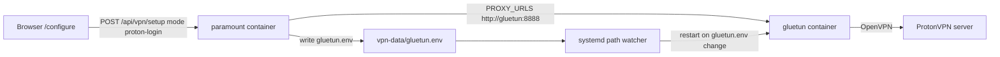
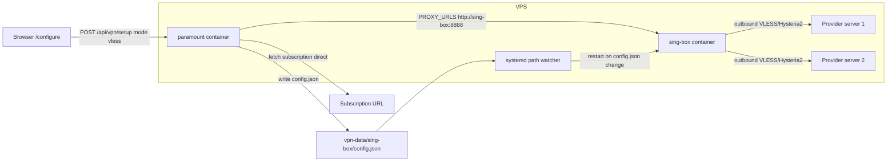

# VLESS Proxy Replacement — sing-box (spec)

> Sostituisce ProtonVPN/gluetun con un container **sing-box** che si connette ai
> server VLESS/Hysteria2/VMess/Trojan/SS di una **subscription URL**, con
> configurazione **swappabile dalla UI `/configure`** (nessun SSH).

---

## 1. Obiettivo

- L'utente incolla una **subscription URL** (es. `https://provider.com/sub?token=...`)
  in `/configure`.
- L'addon scarica la subscription, decodifica la base64, estrae i link
  (`vless://`, `hysteria2://`, `vmess://`, `trojan://`, `ss://`).
- Genera un `config.json` per **sing-box** con:
  - inbound **HTTP proxy** su `0.0.0.0:8888` (stessa interfaccia di gluetun → zero
    cambi a `lib/http/client.ts` e `proxy-agent`);
  - outbound **urltest** su tutti i server della subscription (failover automatico);
  - possibilità di fissare un server specifico dalla UI.
- Scrive `vpn-data/sing-box/config.json` (bind-mount) → la systemd path unit
  riavvia il container `sing-box` automaticamente (stesso meccanismo di oggi).
- `PROXY_URLS` default diventa `http://sing-box:8888`.

## 2. Architettura attuale (da sostituire)



## 3. Architettura target



**Perché sing-box** (scelto dall'utente):
- un solo binario/container supporta VLESS, Hysteria2, VMess, Trojan, Shadowsocks;
- è il motore che Hiddify usa sotto il cofano;
- inbound HTTP proxy → `proxy-agent` continua a funzionare senza modifiche;
- outbound `urltest` → failover automatico tra i server della subscription
  (migliore del round-robin dell'addon, che vede un solo proxy).

## 4. File nuovi

| File | Scopo |
|:-----|:------|
| `lib/vpn/share-links.ts` | Parser dei share-link (`vless://`, `hysteria2://`, `vmess://`, `trojan://`, `ss://`) → `ParsedServer[]` |
| `lib/vpn/singbox.ts` | `fetchSubscription()`, `buildSingBoxConfig()`, `writeSingBoxConfig()`, `readCurrentVlessConfig()`, `clearSingBoxConfig()` |
| `app/api/vpn/preview/route.ts` | POST: scarica+parsa la subscription **senza salvare** (per la UI "Fetch servers") |
| `tests/vpn-share-links.test.ts` | Unit test parser + config builder |
| `scripts/install-vpn-watcher.sh` | Watcher systemd generalizzato (osserva `vpn-data/sing-box/config.json`, riavvia `sing-box`) |
| `scripts/restart-sing-box.sh` | Crea/riavvia il container `sing-box` e attende healthy |

## 5. File modificati

| File | Modifica |
|:-----|:---------|
| `docker-compose.yml` | Sostituisce il servizio `gluetun` con `sing-box`; `PROXY_URLS` default `http://sing-box:8888`; `depends_on` → `sing-box` |
| `lib/vpn/storage.ts` | Aggiunge `singBoxDir`, `singBoxConfig`, `singBoxServers` a `VPN_DATA_PATHS` |
| `app/api/vpn/setup/route.ts` | Aggiunge mode `vless`; `proton-login` deprecato (errore "use vless") |
| `app/api/vpn/status/route.ts` | `readCurrentConfig()` esteso per kind `vless` |
| `app/api/vpn/servers/route.ts` | Se vless attivo → ritorna i server parsati (cache `servers.json`), altrimenti legacy `PROTON_COUNTRIES` |
| `app/configure/vpn-card.tsx` | Nuova sezione "🧩 VLESS / Subscription" (input URL, Fetch servers, select server, Save & connect) |
| `scripts/deploy-vpn-update.sh` | Aggiornato per sing-box (rimuove gluetun legacy) |
| `README.md`, `.env.example` | Documentazione VLESS |

## 6. Parser share-link (`lib/vpn/share-links.ts`)

Formati supportati (v1):

- **vless**: `vless://uuid@host:port?encryption=none&security=tls&type=ws&host=SNI&path=%2Fws&flow=xtls-rprx-vision#name`
- **hysteria2**: `hysteria2://password@host:port?insecure=1&sni=SNI#name`
- **vmess**: `vmess://base64url(JSON)` con `{v,ps,add,port,id,aid,scy,net,type,host,path,tls,sni}`
- **trojan**: `trojan://password@host:port?security=tls&sni=SNI#name`
- **ss**: `ss://base64url(method:password)@host:port#name` (SIP002)

Output: `ParsedServer { tag, protocol, host, port, uuid?, password?, method?, tls?, sni?, insecure?, flow?, transport?, wsHost?, wsPath?, grpcServiceName? }`

Regole:
- `tag` = fragment `#name` (fallback `host:port`).
- `security=tls` → `tls.enabled=true`, `server_name=sni||host`.
- `insecure=1` → `tls.insecure=true`.
- `type=ws` → transport ws con `path` e `host`; `type=grpc` → `serviceName`; assente → tcp.
- Link non parsabili → saltati con warning (mai bloccare l'intera subscription).

## 7. Config builder sing-box (`lib/vpn/singbox.ts`)

```jsonc
{
  "log": { "level": "info", "timestamp": true },
  "inbounds": [
    { "type": "http", "tag": "http-in", "listen": "0.0.0.0", "listen_port": 8888 }
  ],
  "outbounds": [
    { "type": "urltest", "tag": "auto", "outbounds": ["srv-1", "srv-2"] },
    { "type": "vless", "tag": "srv-1", "server": "...", "server_port": 443,
      "uuid": "...", "flow": "xtls-rprx-vision",
      "tls": { "enabled": true, "server_name": "..." },
      "transport": { "type": "ws", "path": "/ws", "headers": { "Host": "..." } } },
    { "type": "hysteria2", "tag": "srv-2", "server": "...", "server_port": 443,
      "password": "...", "tls": { "enabled": true, "server_name": "...", "insecure": false } }
  ],
  "route": { "final": "auto" }
}
```

- Se l'utente seleziona un server specifico → `route.final` = tag di quel server
  (invece di `auto`).
- `fetchSubscription(url)`: fetch **diretto** (NO proxy — chicken-and-egg) con
  `User-Agent: sing-box/1.11.0` (configurabile via `SUBSCRIPTION_USER_AGENT`).
  Decodifica base64 (normalizza `-`/`_`, aggiunge padding). Se il testo contiene
  già `://` → parsa direttamente. Se è YAML/JSON Clash → errore chiaro
  ("Clash YAML non ancora supportato").
- `writeSingBoxConfig()`: scrive `config.json` (0o600) + cache `servers.json`
  (lista parsata per `/api/vpn/servers`).

## 8. API

### `POST /api/vpn/setup` — nuovo mode `vless`
```jsonc
{ "mode": "vless", "subscriptionUrl": "https://...", "serverTag": "auto" }
```
1. `fetchSubscription` + parse → `ParsedServer[]`.
2. `buildSingBoxConfig(servers, serverTag)` → `writeSingBoxConfig()`.
3. `setProxyUrls(['http://sing-box:8888'])`.
4. `saveCreds({ mode: 'vless', subscriptionUrl, serverTag, serverCount, updatedAt })`.
5. Risposta: `{ ok, message, servers: [{tag, protocol, host, port}], proxyUrls }`.

`proton-login` → risposta deprecata: `{ ok:false, error: "ProtonVPN deprecato: usa mode vless" }`.
`proxy` e `clear` invariati.

### `POST /api/vpn/preview` (nuovo)
```jsonc
{ "subscriptionUrl": "https://..." }
```
→ scarica+parsa **senza salvare**: `{ ok, servers: [{tag, protocol, host, port}] }`.
Usato dalla UI per mostrare la lista prima del salvataggio.

### `GET /api/vpn/status`
- `config.kind` = `vless` quando esiste `config.json` → `{ serverTag, serverCount, updatedAt }`.
- `savedCreds` include `subscriptionUrl` (masked) e `serverTag`.

### `GET /api/vpn/servers`
- vless attivo → server parsati dalla cache `servers.json`.
- altrimenti → `PROTON_COUNTRIES` (legacy).

## 9. UI `/configure` (`vpn-card.tsx`)

Nuova sezione **"🧩 VLESS / Subscription"** (in cima, primary):
- Input: subscription URL (o share-link singolo — il parser lo rileva).
- Bottone **"Fetch servers"** → `POST /api/vpn/preview` → mostra lista
  `tag · protocol · host:port`.
- Select: **Auto (urltest)** + ogni server.
- Bottone **"Save & connect"** → `POST /api/vpn/setup { mode:'vless', ... }`.
- Badge stato: `🧩 VLESS: <serverTag> (N servers)`.
- Sezione ProtonVPN rimossa (deprecata). Sezione HTTP proxy invariata.

## 10. docker-compose.yml

```yaml
sing-box:
  image: ghcr.io/sagernet/sing-box:latest
  container_name: sing-box
  restart: unless-stopped
  profiles: [vpn]
  # Nessun NET_ADMIN/TUN: modalità outbound proxy (non TUN).
  volumes:
    - ./vpn-data/sing-box:/etc/sing-box
  environment:
    - SING_BOX_CONFIG=/etc/sing-box/config.json
  networks: [default]
  logging: { driver: json-file, options: { max-size: "10m", max-file: "3" } }
  healthcheck:
    # Test full-chain: CONNECT attraverso il proxy HTTP locale.
    test: ["CMD", "wget", "-qO-", "-e", "use_proxy=yes",
           "-e", "http_proxy=http://127.0.0.1:8888",
           "https://www.gstatic.com/generate_204"]
    interval: 30s
    timeout: 10s
    start_period: 15s
    retries: 3
```

`paramount`:
- `depends_on: sing-box: { condition: service_healthy, required: false }`
- `PROXY_URLS=${PROXY_URLS:-http://sing-box:8888}`
- volume `./vpn-data:/app/.data/vpn` invariato (config.json scritto dall'addon).

## 11. Watcher systemd + script

- `scripts/install-vpn-watcher.sh` (nuovo, generalizzato):
  - osserva `vpn-data/sing-box/config.json` (`PathExists` + `PathModified`);
  - `ExecStart: docker compose --profile vpn up -d sing-box`;
  - `ExecStartPost: bash scripts/restart-sing-box.sh`;
  - `--uninstall` rimuove anche il vecchio watcher gluetun.
- `scripts/restart-sing-box.sh`: crea placeholder `config.json` se manca, `up -d`,
  attende healthy (max 60s), log su fallimento.
- `scripts/deploy-vpn-update.sh`: aggiornato; rimuove container gluetun legacy
  (`docker compose --profile vpn rm -f gluetun`).

## 12. Deploy sul VPS

1. Commit + push (catalog fix + VLESS).
2. `ssh ubuntu@92.4.220.196` → `cd /opt/paramount-stremio && git pull`.
3. `docker compose up -d --build` (paramount ricreato, PROXY_URLS nuovo default).
4. `sudo bash scripts/install-vpn-watcher.sh` (installa watcher sing-box, rimuove gluetun).
5. `docker compose --profile vpn rm -f gluetun` (pulizia legacy).
6. UI `/configure` → incolla subscription → Fetch servers → Save → Test connection.

## 13. Test

- **Unit** (`tests/vpn-share-links.test.ts`): parsing vless/hysteria2/vmess/trojan/ss,
  base64 URL-safe, config builder (urltest, server fisso, ws/grpc/tcp, insecure).
- **E2E**: subscription reale → preview mostra server → save → `docker logs sing-box`
  mostra outbound up → `🧪 Test connection` OK → catalogo sport funziona.
- **Failover**: spegni il server selezionato → urltest passa a un altro → probe OK.

## 14. Pulizia legacy (configurazione minima)

L'utente vuole solo: **VLESS proxy + account Paramount**. Rimuovere tutto il resto.

### Da ELIMINARE (file interi — verificato con grep, nessun import)

| File | Motivo |
|:-----|:-------|
| `lib/vpn/wireguard.ts` | Vecchia modalità WireGuard Proton — **zero import** in tutto il repo |
| `lib/vpn/gluetun.ts` | Sostituito da `lib/vpn/singbox.ts`; `PROTON_COUNTRIES` usato solo da `servers/route.ts` che viene riscritto |
| `lib/mediaflowproxy/mediaflowproxy.ts` | Importato **solo** dal branch MFP dello stream route (righe 159-176) — branch rimosso |
| `scripts/install-gluetun-watcher.sh` | Sostituito da `scripts/install-vpn-watcher.sh` |
| `scripts/restart-gluetun.sh` | Sostituito da `scripts/restart-sing-box.sh` |
| `scripts/debug-live-listings.cjs` | Script di debug temporaneo (untracked) |
| `plans/install-fix-spec.md`, `plans/review-report.md`, `plans/sports-only-view-spec.md`, `plans/sports-view-rework.md` | Spec storiche di sviluppo — non più rilevanti |
| `analysis.md` | Documento di analisi iniziale — non più rilevante |

### Da PULIRE (metodi morti dentro file vivi — verificato con grep)

| File | Modifica |
|:-----|:---------|
| `lib/paramount/client.ts` | Rimuovere **12 metodi mai chiamati** (definiti solo in client.ts): `getFeaturedHome`, `getCarouselItems`, `getShowsGroups`, `getShowsGroup`, `getMoviesGroups`, `getMoviesGroup`, `getVideoSection`, `getSeasons`, `getEpisodes`, `getAppConfig`, `refreshCookies`, `getLiveChannelListings` |
| `app/api/stremio/[key]/stream/[type]/[[...id]]/route.ts` | Rimuovere import (riga 16) e branch `MFP_URL` (righe 159-176, `wrapUrlWithMediaFlow`) |
| `docker-compose.yml` | Rimuovere `MFP_URL`/`MFP_PASS` dalle environment |
| `.env.example` | Rimuovere `MFP_URL`, `MFP_PASS`, sezione ProtonVPN/gluetun; aggiungere `SUBSCRIPTION_USER_AGENT` |
| `README.md` | Sezione ProtonVPN → sezione VLESS; rimuovere riferimenti gluetun/MFP |

### Da MANTENERE (necessari)

- `lib/http/sid.ts` + `app/api/proxy/[sid]/...` — proxy MPD/seg/license per VOD (Widevine)
- `lib/paramount/proxy/hls.ts`, `mpd.ts` — rewriting HLS/MPD
- `app/api/install/[token]/manifest.json/route.ts` + catch-all — entry point Stremio
- `lib/auth/*`, `lib/paramount/client.ts`, `lib/paramount/sports.ts`, `catalogs.ts`, `types/*` — core addon
- `lib/http/client.ts` — proxy rotation (usato da tutto)
- `proxy.ts` — middleware logging (utile, innocuo)
- `scripts/deploy-docker.sh`, `deploy-vpn-update.sh`, `install-oracle.sh`, `update-*.sh`, `setup-swap.sh` — deploy VPS
- `deploy/oracle/README.md` — documentazione deploy

## 15. Cosa fa l'addon (riassunto per l'utente)

```mermaid
flowchart TD
    A[Stremio app] -->|manifest.json| B[Addon /api/install/token]
    B --> C[Catalog sport: live + replay per league]
    B --> D[Meta: dettagli evento/partita]
    B --> E[Stream: risolvi URL HLS/MPD]
    E --> F[Proxy HLS/seg/license]
    F --> G[Paramount+ CDN via sing-box proxy]
    C --> G
    H[/configure] -->|login Paramount| I[Sessioni JWE cifrate]
    H -->|subscription VLESS| J[sing-box config.json]
    J --> K[systemd watcher riavvia sing-box]
```

1. **Login Paramount** (`/configure`): device-code o password → cookies salvati cifrati (JWE) in `.data/sessions/`.
2. **Manifest** (`/api/install/<token>/manifest.json`): catalogs sport (Serie A, UCL, UEL, UECL, Altro), meta, stream.
3. **Catalog**: per ogni league → live/upcoming da `/live/channels/{slug}/listings.json` + replay VOD filtrati per `seriesTitle` (fix cataloghi mischiati).
4. **Stream**: sport → HLS live (proxy hls/seg/license); VOD → MPD + Widevine (proxy mpd/seg/license).
5. **Proxy**: tutte le chiamate a Paramount+ passano da `lib/http/client.ts` → `PROXY_URLS` → `http://sing-box:8888` → server VLESS.
6. **VPN**: subscription URL incollata in `/configure` → `config.json` sing-box → watcher systemd riavvia il container → failover `urltest`.

## 16. Rischi / note

- **Credenziali in chiaro**: `config.json` contiene uuid/password (come oggi
  `gluetun.env`). Dir `vpn-data/sing-box` 0o700, file 0o600, proprietà uid 1000.
- **Subscription URL con token**: salvata cifrata in `creds.enc` (AES-256-GCM).
- **Clash YAML/JSON**: non supportato in v1 (errore chiaro). Estensione futura.
- **Reality** (`security=reality`): non supportato in v1 (tls standard + ws/grpc/tcp).
- **Healthcheck**: richiede `wget` (busybox) nell'immagine sing-box (Alpine → presente).
- **gluetun.ts / PROTON_COUNTRIES**: mantenuti come legacy per compatibilità
  (non più usati dalla UI).
- **Catalog fix** (`lib/paramount/sports.ts`): già scritto e verificato (tsc+eslint),
  va committato e deployato insieme (o prima) di questo lavoro.